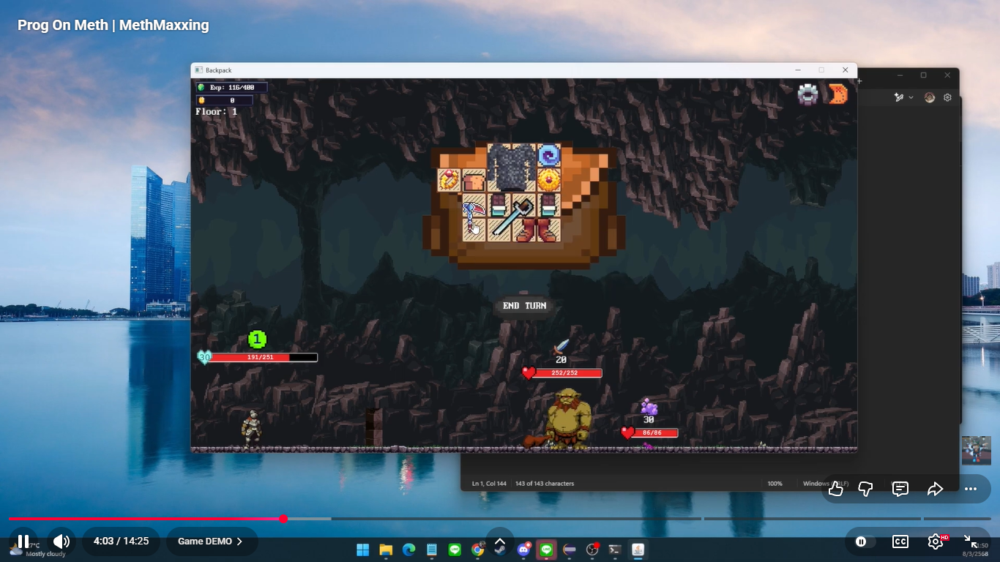

# Backpack Adventure

## [Demo](https://www.youtube.com/watch?v=PGsi5I9AjT8)

**A Project for Programming Methodology course**, made with love ♥ by the best and coolest engineer in the uni.

This Game is inspired by The game "[Backpack Hero](https://store.steampowered.com/app/1970580/Backpack_Hero/)" developed by Jaspel.

## Rules
The game starts with some initial items each having their unique type and effects, the player will be able to take said items into their backpack, otherwise the items will disappear after changing scenes.

The player can open the map and choose where to go. There are monsters, a portal to the next level and a healer.

The fighting is a turn based system where the player starts first. The player can see the monster action on their turn, the player can use items in their backpack to fight the monster accordingly, when all monsters are dead the game will drop items for the player of which player can take a total maximum of 3 items and clear the monster on the map for the player. 

The player can level up after reaching enough experience points when level up player’s max health is increase and the player can unlock more backpack slots

The game will end when the player asserts dominance over the last demon or when the player dies in combat.

Note: Press “R” to Rotate Item

## Code details
The game is written in Java with JavaFX library

`Expect spaghetti code.`
